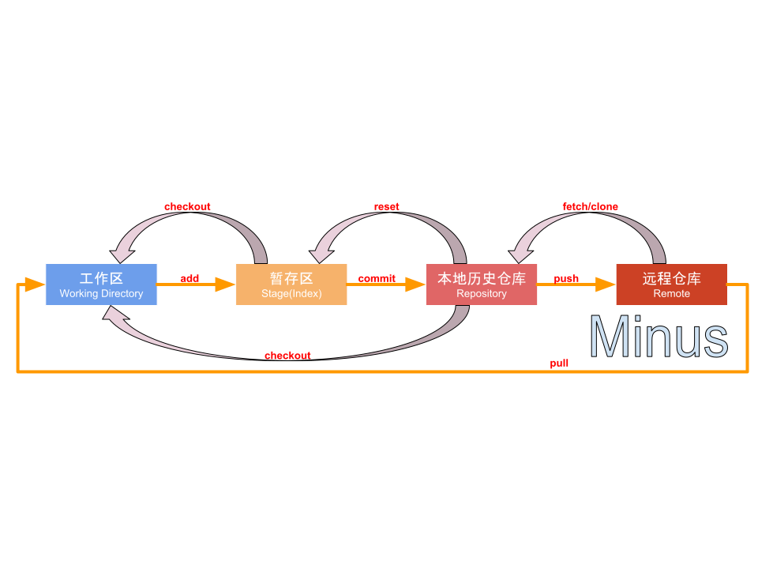

[Git使用总结](https://www.jianshu.com/p/7220132da61b?utm_campaign=maleskine&utm_content=note&utm_medium=seo_notes&utm_source=recommendation)

[Git 王者超神之路](https://www.jianshu.com/p/f4cd5f2d1a5f)

## 文件的几个状态

按大类划分，分为两种状态：Tracked(已跟踪)和Untracked(未跟踪)，依据是：该文件是否已加入版本控制？

流程简述：假设某个项目已加入版本控制系统

1.新建一个文件，该文件处于`Untracked 状态`；工作区
2.通过`git add`命令添加到`缓存区`，此时文件处于`Tracked状态`又或者说此时这个文件已经被版本控制系统所跟踪，而且他处于`Staged(暂存)状态`；
3.通过`git commit`命令把暂存区的文件提交提交到本地仓库，此时文件处于`Unmodified(未修改)状态`；
4.此时如果去编辑这个文件，文件又会变成`Modified(修改)状态`；

## 一、本地操作命令

>1.相关配置【git config】

区分global 和 local，前者代表全局设置，就是设置了在整个系统中，所有的带Git版本管理的项目都是这样的配置；后者代表`本地设置,即在某个项目中独立的设置，优先级高于全局设置`。比如全局设置的用户名是"Coder-pig"，本地设置的是"Jay"，commit的时候author就是Jay而不是Coder-pig。除了通过命令行修改，还可以直接修改对应文件：

全局配置文件：etc/gitconfig (Mac下是隐藏文件，用户/.gitconfig)
`本地配置文件：当前仓库/.git/config`

### 1.1 安装完Git后第一件要做的事，设置用户信息(global可换成local在单独项目生效)：

```
git config --global user.name "用户名" # 设置用户名
git config --global user.email "用户邮箱"   #设置邮箱
git config --global user.name   # 查看用户名是否配置成功
git config --global user.email   # 查看邮箱是否配置
```

### 1.2 其他查看配置相关

```
git config --global --list  # 查看全局设置相关参数列表
git config --local --list # 查看本地设置相关参数列表
git config --system --list # 查看系统配置参数列表
git config --list  # 查看所有Git的配置(全局+本地+系统)
```

>2.获取帮助【git help】

`git help` 命令   # 如：`git help init`

>3.创建本地仓库【git init】
`git init 仓库名` # 创建一个新的带Git仓库的项目
`git init` # 为已存在的项目生成一个Git仓库

>4.添加文件到暂存区/文件跟踪标记【git add】
可以使用git add 文件名，将工作空间的文件添加到暂存区，或批量添加文件

```
git add 文件名 # 将工作区的某个文件添加到暂存区

git add -u # 添加所有被tracked文件中被修改或删除的文件信息到暂存区，不处理untracked的文件

git add -A # 添加所有被tracked文件中被修改或删除的文件信息到暂存区，包括untracked的文件

git add . # 将当前工作区的所有文件都加入暂存区

git add -i # 进入交互界面模式，按需添加文件到缓存区
```


```
1.先在GitForTest的文件夹里创建了两个文件
2.键入git add -i，进入后，键入4，选择添加untracked的文件
3.他给我们列出了untracked的文件，然后我们根据序号来添加文件
4.输入?会弹出相关提示，然后直接回车，结束选择！
5.然后再次输入git add -i，输入4，可以看到已不存在untacked的文件了！
```

>5.让Git不Tracked特定文件【.gitignore文件配置】

将未tracked的文件添加到缓存区后，Git就会开始跟踪这个文件了！对于一些比如：自动生成的文件，日志，临时编译文件等，就没必要进行跟踪了，这个时候可以编写.gitignore文件，在里面把不需要跟踪的文件或文件夹都写上，git就不会对这些文件进行跟踪！另外.gitignore文件与.git文件夹在同级目录下！

如果不想自己写，可以直接到：https://github.com/github/gitignore 复制粘贴！
也可以自行编写，支持简化了的正则表达式(规范与示例模板摘自：Git王者超神之路)

***** ： 匹配零个或多个任意字符
[abc]：只匹配括号内中的任意一个字符
[0-9]：- 代表范围，匹配0-9之间的任何字符
?：匹配任意一个字符
******：匹配任意的中间目录，例如a/**/z可以匹配:a/z,a/b/z,a/b/c/z等
示例模板：

```
忽略所有以 .c结尾的文件
`*.c`
 
但是 stream.c 会被git追踪
`!stream.c`
 
只忽略当前文件夹下的TODO文件, 不包括其他文件夹下的TODO例如: subdir/TODO
`/TODO`
 
忽略所有在build文件夹下的文件
`build/`
 
忽略 doc/notes.txt, 但不包括多层下.txt例如: doc/server/arch.txt
`doc/*.txt`
 
忽略所有在doc目录下的.pdf文件
`doc/**/*.pdf`
```

！！！特别要注意一点！！！：

配置.gitignore只对那些没有添加到版本控制系统的文件生效(未Tracked的文件)！

举个例子：

有A，B两个文件，你先把他两个add了，然后在.gitignore文件中配置了不跟踪这两个文件，但是你会发现根本不会生效。

git add A
git add B

配置不跟踪A和B
git add .gitignore

所以，最好的做法就是在项目刚开始的时候，先添加.gitignore文件。当然，即使是发生了，还是有解决方法的，可以键入下述命令清除标记状态，然后先添加.gitignore，再添加文件即可：

`git rm -r --cached . #清除版本控制标记，.代表所有文件，也可指定具体文件`

还有，如果你用的是IDEA的编辑器的话，可以下一个.ignore的插件，可以手动直接勾选不需要跟踪的文件。

>6.将暂存区内容提交到本地仓库【git commit】

```
git commit -m "提交说明" # 将暂存区内容提交到本地仓库
git commit -a -m "提交说明" # 跳过缓存区操作，直接把工作区内容提交到本地仓库
```

如果不加-m "提交说明"，git会让用你让默认编辑器(如vi)来编写提交说明，
可能有些朋友用不惯vi，要么别漏掉-m "提交说明"，要么自己设置编译器：

git config --global core.edit 喜欢的编辑器
除此之外，有时可能需要修改上次提交的内容，比如修改提交说明，或者修改文件等：

```
合并暂存区和最近的一次commit，生成新的commit并替换掉老的,如果缓存区没内容，利用amend可以修改上次commit的提交说明
注：因为amend后生成的commit是一个全新的commit，旧的会被删除，所以别在公共的commit上使用amend！切记！！！

git commit --amend 
git commit --amend --no-edit # 沿用上次commit的提交说明
```

>7.查看工作区与缓存区的状态【git status】

`git status` # 查看工作区与暂存区的当前情况
`git status -s` # 让结果以更简短的形式输出

>8.差异对比(内容变化)【git diff】

git diff # 工作区与缓存区的差异

git diff 分支名 #工作区与某分支的差异，远程分支这样写：remotes/origin/分支名

git diff HEAD  # 工作区与HEAD指针指向的内容差异

git diff 提交id 文件路径 # 工作区某文件当前版本与历史版本的差异

git diff --stage # 工作区文件与上次提交的差异(1.6 版本前用 --cached)

git diff 版本TAG # 查看从某个版本后都改动内容

git diff 分支A 分支B # 比较从分支A和分支B的差异(也支持比较两个TAG)

git diff 分支A...分支B # 比较两分支在分开后各自的改动

另外：如果只想统计哪些文件被改动，多少行被改动，可以添加 --stat 参数

>9.查看历史提交记录【git log】

git log # 查看所有commit记录(SHA-A校验和，作者名称，邮箱，提交时间，提交说明)

git log -p -次数 # 查看最近多少次的提交记录

git log --stat # 简略显示每次提交的内容更改

git log --name-only # 仅显示已修改的文件清单

git log --name-status # 显示新增，修改，删除的文件清单

git log --oneline # 让提交记录以精简的一行输出

git log –graph –all --online # 图形展示分支的合并历史

git log --author=作者  # 查询作者的提交记录(和grep同时使用要加一个--all--match参数)

git log --grep=过滤信息 # 列出提交信息中包含过滤信息的提交记录

git log -S查询内容 # 和--grep类似，S和查询内容间没有空格

git log fileName # 查看某文件的修改记录，找背锅专用

除此之外，还可以通过 --pretty 对提交信息进行定制，比如：

更多规则与定制如下(摘自：Git王者超神之路)，或参见：Viewing the Commit History ：

format对应的常用占位符：(注：作者是指最后一次修改文件的人，提交者是提交该文件的人)

占位符	说明	占位符	说明
%H	提交对象（commit）的完整哈希字串	%h	提交对象的简短哈希字串
%T	树对象（tree）的完整哈希字串	%t	树对象的简短哈希字串
%P	父对象（parent）的完整哈希字串	%p	父对象的简短哈希字串
%an	作者（author）的名字	%ae	作者的电子邮件地址
%ad	作者修订日期（可以用 --date= 选项定制格式）	%ar	按多久以前的方式显示
%cn	提交者(committer)的名字	%ce	提交者的电子邮件地址
%cd	提交日期	%cr	提交日期，按多久以前的方式显示
%s	提交说明
一些其他操作：

选项	说明
-p	按补丁格式显示每个更新之间的差异
--stat	显示每次更新的文件修改统计信息(行数)
--shortstat	只显示 --stat 中最后的行数修改添加移除统计
--name-only	仅在提交信息后显示已修改的文件清单
--name-status	显示新增、修改、删除的文件清单
--abbrev-commit	仅显示 SHA-1 的前几个字符，而非所有的 40 个字符
--relative-date	使用较短的相对时间显示（比如，“2 weeks ago”）
--graph	显示 ASCII 图形表示的分支合并历史
--pretty	格式定制，可选选项有：oneline，short，full，Fullerton和format(后跟指定格式)
还有一些限制log输出的选项

选项	说明
-(n)	仅显示最近的 n 条提交
--since, --after	仅显示指定时间之后的提交。
--until, --before	仅显示指定时间之前的提交。
--author	仅显示指定作者相关的提交。
--committer	仅显示指定提交者相关的提交。
--grep	仅显示含指定关键字的提交
-S	仅显示添加或移除了某个关键字的提交

>10.查看某行代码是谁写的【git blame】

`git blame 文件名` # 查看某文件的每一行代码的作者，最新commit和提交时间

Tip：如果你用的IDEA系列的编译器，右键行号，选择Annotate也可以实现同样的效果

>11.设置Git命令别名【git config --global alias】

可以为常见的命令起个简单的别名，就不用每次都敲完整命令，比如可以设置：
status为st，checkout为co ; commit为ci ; branch为br等

git config --global alias.st status

>12.为重要的commit打标签【git tag】

对于某些提交，我们可以为它打上Tag，表示这次提交很重要，比如为一些正式发布大版本的commit，打上TAG，当某个版本出问题了，通过TAG可以快速找到此次提交，拿到SHA1值，再去查找问题，比起一个个commit看，省事很多！

Git标签分两种：轻量标签 和 附加标签
前者只是在提交上加个Tag，指向提交的Hash值；而后者还会保存打标签者的信息，时间和附加信息；

git tag 标记内容 # 轻量标签
git tag -a 标记内容 -m "附加信息" # 附加标签
如果想为之前的某次commit打TAG的话，可以先找出SHA1值，设置调下述命令：

git tag -a 标记内容 版本id # 比如：git tag -a v1.1 bcfed96
默认情况，git push不会把标签推送TAG到远程仓库，如果想推送到服务器，可以：

git push origin 标记内容 # 推送某标签到

删除所有本地仓库中不存在的TAG：
git push origin --tags 
另外，可以在新建分支的时候也加上TAG

git checkout -b 分支名 标记内容
还可以用show命令查看标签对应的信息

git show 标记内容
如果你想删除本地Tag：

git tag -d 标记内容
如果是删除远程Tag：

git push origin --delete tag 标记内容

>13.Git命令自动补全【输命令的时候按两次tab键】

## 文件回复/版本回退

1.文件恢复(未commit)【git checkout】
如果在工作区直接删除被Git Tracked的文件，暂存区中还会存在该文件，
此时键入：git status，会是这样：

Git告诉你工作区的文件被删除了，你可以 删掉暂存区里的文件或 恢复被删文件

```
# 删除暂存区中的文件：
git rm 文件名
git commit -m "提交说明"

# 误删恢复文件
git checkout -- 文件名
```

另外注意：git checkout会抛弃当前工作区的更改!!!不可恢复！！！务必小心！！！

2.文件恢复(已add未commit)【git reset HEAD】
如果更改后add到了暂存区，想恢复原状，下述指令可以让文件恢复原状：

```
git reset HEAD 文件名   
git checkout 文件名
```

3.版本回退(已commit)【git reset --hard】
文件已经commit了，想恢复成上次commit的版本或者上上次，可以：

git reset HEAD^ # 恢复成上次提交的版本
git reset HEAD^^ # 恢复成上上次提交的版本，就是多个^，以此类推或用~次数
git reset --hard 版本号 # git log查看到的SHA1值，取前七位即可，根据版本号回退
reset命令其实就是：重置HEAD指针，让其指向另一个commit
而这个动作可能会对工作区与缓存区造成影响，举个例子

本来的分支线：- A - B - C (HEAD, master)
git reset B后：- A - B (HEAD, master)
解释：看不到C了，但是他还是存在的，可以通过git reset C版本号找回，前提是
C没有被Git当做垃圾处理掉(一般是30天)。
reset三个可选参数解析：

--soft：只是改变HEAD指针指向，缓存区和工作区不变；
--mixed：修改HEAD指针指向，暂存区内容丢失，工作区不变；
--hard：修改HEAD指针指向，暂存区内容丢失，工作区恢复以前状态；
4.查看输入指令记录【git reflog】
Git会记住你输入的每个Git指令，比如上面的git reset 切换成一个旧的
commit，然后git log后发现新提交的记录没了，想切换回新的那次commit，
可以先调git reflog 获取新commit的SHA1码，然后git reset 回去。

git reflog

注意：这个指令记录不会永久保存！Git会定时清理用不到的对象！！！

5.撤销某次提交【git revert】
有时可能我们想撤销某次提交所做的更改，可以使用revert命令

git revert HEAD # 撤销最近的一个提交
git revert 版本号 # 撤销某次commit
不是真的把提交给撤销了，而是生成一个新的提交来覆盖旧的提交，被撤销的提交
和新的提交记录都会保存！！！不信你再调一次revert HEAD 会发现被撤销的更改
又变回来了，另外，每次revert后，都需要发起新的commit！
简单点说，撤销的只是文件变化，提交记录依旧是存在的！


6.查看某次提交修改内容【git show】
git show 提交id # 查看某次commit的修改内容
7.查看某个分支的版本号【git rev-parse】
git rev-parse 分支名 # 查看分支commit的版本号，可以写HEAD
8.找回丢失对象的最后一点希望【git fsck】
因为你的某次误操作导致commit丢失，如果git reflog都找不到，你
可以考虑使用git fsck，找到丢失的对象的版本id，然后恢复即可