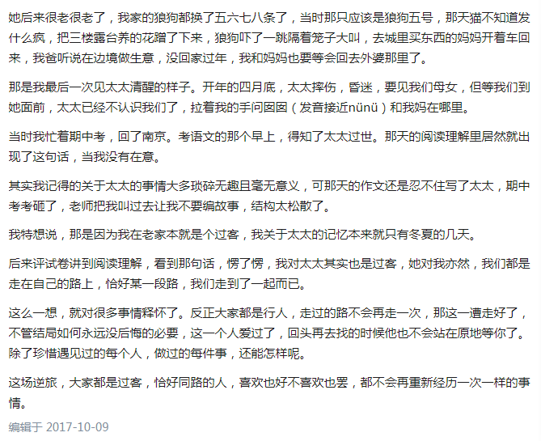

# 人生如逆旅，我亦是行人




# hexo中添加图片的方法

1 设置站点配置_config.yml

post_asset_folder: true

2 安装插件

```
npm install https://github.com/CodeFalling/hexo-asset-image -- save
```

3 引用图片
> \!\[例子\]\(标题/例子.png\)

4 markdown 预览快捷键

`Ctrl+shift+V`

5 Markdown 需要转义的字符
```
\\ 反斜杠
\` 反引号
\* 星号
\_ 下划线
\{\} 大括号
\[\] 中括号
\(\) 小括号
\# 井号
\+ 加号
\- 减号
\. 英文句号
\! 感叹号
```
